# Documentation technique — PSNES Online

Émulateur SNES multijoueur dans le navigateur. Ce document décrit l'architecture
complète, avec une insistance sur la communication multijoueur : le netcode
lockstep, son protocole, et ses chemins de récupération.

Voir aussi [`ARCHITECTURE.md`](ARCHITECTURE.md) (vue par mode, dont streaming et
dual) et [`LOCKSTEP_NETPLAY.md`](LOCKSTEP_NETPLAY.md) (pourquoi ce mode existe,
et son histoire).

---

## Sommaire

1. [Vue d'ensemble](#1-vue-densemble)
2. [Les quatre modes](#2-les-quatre-modes)
3. [Carte du dépôt](#3-carte-du-dépôt)
4. [Le serveur](#4-le-serveur)
5. [Cycle de vie d'une partie](#5-cycle-de-vie-dune-partie)
6. [La pile de transport](#6-la-pile-de-transport)
7. [Le relais et les sièges](#7-le-relais-et-les-sièges)
8. [Le protocole binaire](#8-le-protocole-binaire)
9. [La poignée de main](#9-la-poignée-de-main)
10. [La boucle de frame](#10-la-boucle-de-frame)
11. [Timeline et epoch](#11-timeline-et-epoch)
12. [Blocage et renvoi](#12-blocage-et-renvoi)
13. [Les resynchronisations](#13-les-resynchronisations)
14. [Le contrôle du délai d'entrée](#14-le-contrôle-du-délai-dentrée)
15. [Les métriques du lien](#15-les-métriques-du-lien)
16. [Le canal direct](#16-le-canal-direct)
17. [Cadence et rendu](#17-cadence-et-rendu)
18. [Télémétrie](#18-télémétrie)
19. [Tests](#19-tests)
20. [Déploiement](#20-déploiement)

---

## 1. Vue d'ensemble

Le principe fondateur : **l'émulation tourne côté client dans tous les modes**.
Le serveur ne fait jamais tourner de core SNES. Il assure la signalisation, le
relais d'octets, et la persistance — comptes, jeux, sauvegardes. Chaque joueur
exécute sa propre instance de snes9x compilée en WebAssembly.

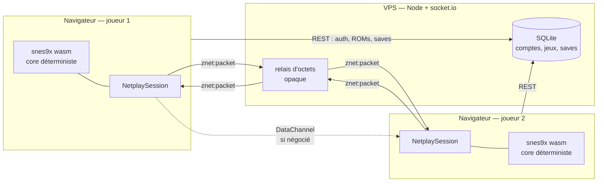

Le chemin en pointillés court-circuite le relais quand la négociation WebRTC
aboutit.

> **Conséquence de conception.** Un serveur qui ne lit pas les paquets ne peut ni
> arbitrer, ni corriger, ni détecter une triche. Toute la cohérence repose sur le
> déterminisme du core et sur le protocole entre pairs — d'où l'échange
> périodique de checksums et les chemins de resynchronisation décrits plus bas.

---

## 2. Les quatre modes

Une room démarre dans l'un de quatre modes, choisi à la création et non
modifiable en cours de partie — en changer démonterait une session vivante.

| Mode | Composant | Logique | Coût |
|---|---|---|---|
| `lockstep` (défaut) | `LockstepRoom.svelte` | `lib/znet/` | D frames de latence d'entrée, blocage franc si le réseau hoquette |
| `single` | `SoloRoom.svelte` | `lib/znet/solo.ts` | — |
| `streaming` | `P2PRoom.svelte` | `lib/multiplayer/streaming-mode.ts` | l'invité subit la latence d'encodage vidéo, pas de savestate partagé |
| `dual` (alpha) | `P2PRoom.svelte` | `lib/multiplayer/dual-mode.ts` | peut diverger silencieusement |

`lockstep` est le défaut (`backend/src/websocket/room-handlers.ts`) et le seul
activement développé ; c'est lui que décrit le reste de ce document. `single`
réutilise la même machine à états sans pair distant. `streaming` et `dual`
partagent une connexion WebRTC média et n'ont rien à voir avec le netcode
ci-dessous.

---

## 3. Carte du dépôt

```
core/                  core snes9x wasm + suites de tests netcode
  src/  build.sh        compilation Emscripten
  test/                 harness, tests protocole/lockstep/déterminisme

frontend/src/lib/
  znet/                 LE MOTEUR LOCKSTEP  (voir sections 6 à 16)
    session.ts          machine à états, transport, epoch
    pad-timeline.ts     ce qui a été échantillonné, ce qui est arrivé
    link-metrics.ts     RTT, gigue, retards, rafales d'arrivée
    delay-control.ts    politique du délai d'entrée (décide, n'applique pas)
    protocol.ts         encodage binaire du fil
    transport.ts        interface Transport + lien simulé
    socket-transport.ts relais socket.io
    webrtc-transport.ts canal direct SCTP
    upgrading-transport.ts  politique de bascule
    lag-transport.ts    distance simulée (?lag=)
    governor.ts         le seul propriétaire de timer de la pile
    core.ts loader.ts   chargement et pilotage du wasm
    output.ts webgl-renderer.ts  rendu et audio
    input.ts devices.ts manettes et clavier
    compress.ts         RLE pour la savestate
  components/           LockstepRoom, SoloRoom, P2PRoom
  webrtc/               P2PManager — vidéo uniquement
  multiplayer/          modes streaming et dual
  rooms/ saves/ lobby/  état applicatif

backend/src/
  websocket/            znet, rooms, invitations, ROM, présence
  api/ auth/ db/ saves/ REST, OAuth, SQLite, migrations
  bootstrap/            racine de composition (ordres de démarrage)
```

---

## 4. Le serveur

Toute la communication temps réel passe par socket.io. Les gardes
(`websocket/guards.ts`) résolvent chaque événement contre l'appartenance à la
room : un non-membre obtient le silence, jamais une confirmation d'existence — un
message d'erreur distinct serait un moyen de sonder des identifiants.

| Domaine | Événements reçus |
|---|---|
| room | `room:create` `room:join` `room:leave` |
| lobby | `lobby:invite` `lobby:accept` `lobby:decline` `lobby:cancel` |
| game | `game:start` `game:ready` `game:stop` `game:pause` `game:resume` `game:save` `game:load` `game:input` |
| znet | `znet:join` `znet:packet` `znet:leave` |
| rom | `rom:request` `rom:chunk` `rom:unavailable` |
| webrtc | `webrtc:signal` |
| sync | `sync:checksum` |

Les rooms vivent en mémoire, avec un instantané périodique
(`websocket/room-snapshot.ts`) restauré au démarrage — d'où la ligne
`Restored rooms from the snapshot` dans les logs. L'ordre de démarrage est
explicite dans `bootstrap/` : restaurer les rooms **avant** d'écouter, faute de
quoi un client reconnecté trouverait un serveur sans sa partie.

---

## 5. Cycle de vie d'une partie

De l'invitation à la première frame émulée. Le transfert de ROM et la poignée de
main netplay sont deux mécanismes distincts sur deux canaux distincts : la ROM
passe par le serveur en morceaux, le netcode par le relais opaque.

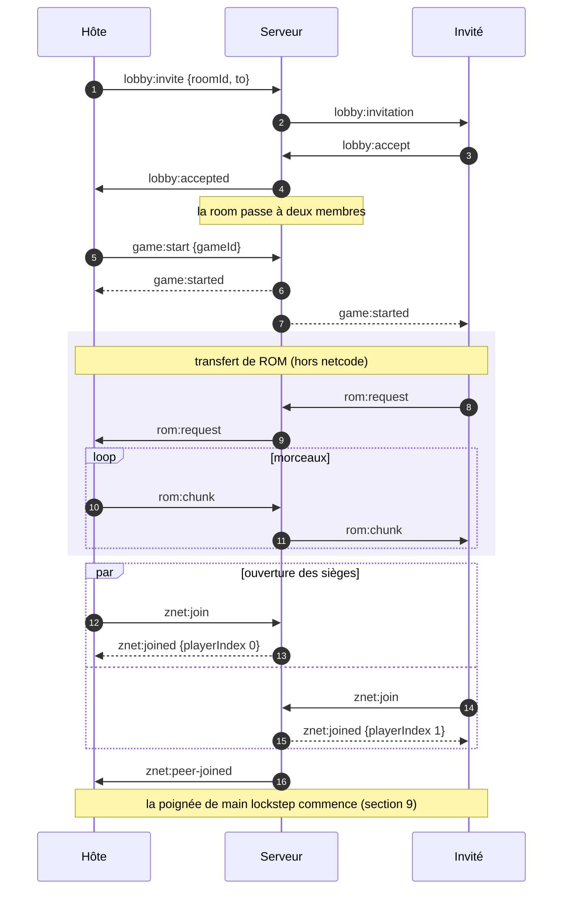

L'hôte est toujours `playerIndex 0`, afin que ses manettes atterrissent sur le
port 1 des deux machines.

---

## 6. La pile de transport

La session ne voit jamais qu'une interface minuscule : `send(bytes)`,
`onMessage(handler)`, `close()`. C'est ce qui permet de faire tourner un match
entier sur une horloge virtuelle sans navigateur, et d'ajouter un canal direct
sans toucher au moteur.

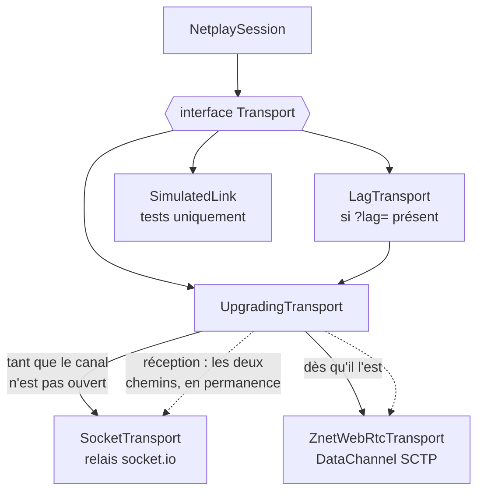

`UpgradingTransport` choisit le chemin sortant **par paquet** — un canal mort
entre deux frames ne doit pas figer la session.

| Classe | Rôle |
|---|---|
| `SocketTransport` | Relais par la connexion socket.io existante. Se réinscrit au siège à chaque reconnexion — sans quoi la session survit au hoquet en apparence mais aucun paquet n'atteint plus le pair. |
| `ZnetWebRtcTransport` | DataChannel `ordered: false` et fiable. Reprise bornée à 3 tentatives de 5 s, puis abandon silencieux. |
| `UpgradingTransport` | Politique de bascule. Émet par le plus rapide disponible, reçoit des deux. |
| `LagTransport` | Distance simulée depuis `?lag=ping[,jitter[,loss]]`. Désactive la bascule WebRTC. |
| `SimulatedLink` | Deux liens unidirectionnels sur horloge virtuelle, avec latence, gigue, perte et graine reproductible. |

---

## 7. Le relais et les sièges

Le serveur tient une liste de sièges par room. Se reconnecter avec le même compte
**reprend le même siège** plutôt que d'en consommer un nouveau : la session
netplay est indexée par numéro de joueur, et un joueur revenu en position 2 ne
piloterait rien.

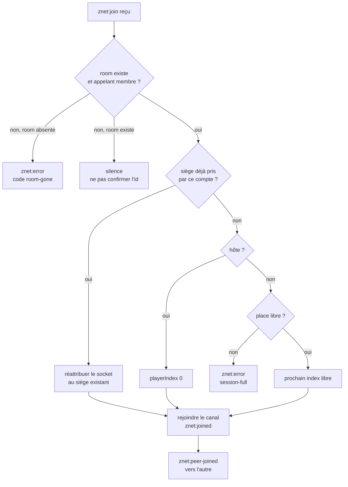

La branche `room-gone` n'existe que lorsque la room est réellement absente. Une
room existante dont l'appelant n'est pas membre doit continuer à n'apprendre
rien.

> **Le piège historique.** Rester silencieux quand la room a disparu faisait
> ressembler une session perdue à un gel : le socket est sain, le client se
> réinscrit à chaque reconnexion, et chaque paquet qu'il envoie ensuite est jeté
> pour cause de non-appartenance au canal.

---

## 8. Le protocole binaire

Tout est une trame binaire plate. Le chemin chaud — les paquets de manettes, une
cinquantaine par seconde et par joueur — doit rester assez petit pour ne jamais
se fragmenter. Version courante : **3**. Un écart fait échouer la poignée de main
plutôt que de dégrader silencieusement.

| Type | Code | Taille | Rôle |
|---|---|---|---|
| `Hello` | 1 | 8 o | version du protocole, CRC de la ROM, index et nombre de joueurs |
| `Pads` | 3 | 10 + 2n | une suite de manettes consécutives, plus strain et délai de l'émetteur |
| `Crc` | 4 | 12 o | checksum de la work RAM à une frame donnée |
| `State` | 5 | 20 o + charge | un morceau de savestate, plus les paramètres de session |
| `StateAck` | 6 | 8 o | accusé d'adoption d'un état |
| `Desync` | 7 | 8 o | divergence constatée, ou demande de resync par l'invité |
| `Ping` / `Pong` | 8 / 9 | 8 o | mesure du temps d'aller-retour |

### Le paquet de manettes, octet par octet

| Offset | Champ | Type |
|---|---|---|
| 0 | type | u8 |
| 1 | playerIndex | u8 |
| 2 | epoch | u8 |
| 3 | nombre de pads | u8 |
| 4–7 | baseFrame | u32 LE |
| 8 | strain | u8 |
| **9** | **inputDelay** | **u8** |
| 10.. | pads | u16 LE × n |

Les frames sont **absolues et partagées** par les deux pairs : c'est ce qui
permet d'appliquer un pad sans savoir quand il a été envoyé, et donc de tolérer
le désordre et la duplication.

Chaque paquet répète délibérément les six dernières frames déjà transmises
(`padRedundancy`). Un datagramme perdu ne coûte alors rien : le suivant porte le
pad manquant. Demander une retransmission coûterait un aller-retour complet
pendant lequel les deux pairs sont bloqués — la seule chose que le lockstep ne
peut pas absorber.

> **L'octet 9.** Le délai de l'émetteur dit au récepteur de combien le pair a le
> droit d'être en retard, ce qui dimensionne la fenêtre de renvoi anti-blocage.
> Il est indéductible du paquet : le délai n'apparaît que dans l'écart entre la
> frame courante de l'émetteur et son pad le plus récent, et cette frame courante
> ne circule pas. Sans lui, deux délais très inégaux produisent un interblocage
> définitif à la première perte.

---

## 9. La poignée de main

L'hôte mesure le lien avant d'expédier son état, parce que le délai d'entrée
voyage *avec* la savestate : l'invité l'adopte en même temps que la machine, et
les premières frames sont amorcées en fonction.

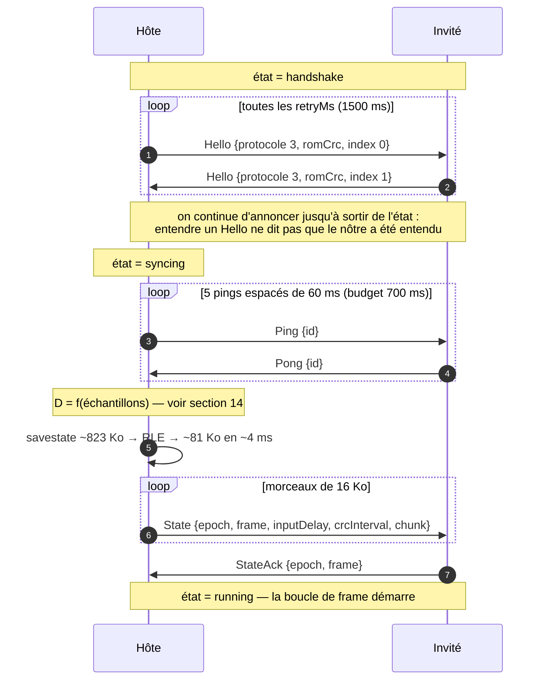

La compression n'est pas un luxe : l'état emprunte le même socket que les pads,
et tant qu'il n'a pas fini de s'écouler tous les pads font la queue derrière. Non
compressé, cela s'est vu en production comme une minute d'attente en début de
session.

### États de session

| État | Signification |
|---|---|
| `idle` | construite, pas démarrée |
| `handshake` | annonce des Hello, en attente du pair |
| `syncing` | hôte : mesure puis expédition de l'état — invité : réassemblage |
| `running` | la boucle de frame tourne |
| `resyncing` | un nouvel epoch est en cours d'expédition |
| `failed` | erreur fatale, jamais rétractée |
| `closed` | transport fermé |

---

## 10. La boucle de frame

Le cœur du lockstep. `tick()` exécute **au plus une** frame et n'a le droit d'en
sauter aucune : sauter est précisément ce qui désynchronise. La fonction est
volontairement une fonction pure du journal de messages, ce qui permet aux tests
de rejouer une session à l'identique — tout ce qui dépend du temps réel vit dans
`pump()`.

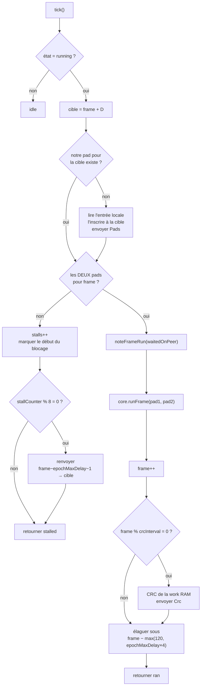

L'échantillonnage se fait une fois par frame *exécutée*, pas par tic d'horloge :
c'est ce qui garde les deux bandes d'entrée de même longueur.

> **Pourquoi l'élagage garde 120 frames.** Un pad élagué est un pad qu'on ne peut
> plus retransmettre, et le pair peut encore l'attendre. Le plancher de 120 frames
> est délibérément très au-dessus de la fenêtre de renvoi.

---

## 11. Timeline et epoch

`PadTimeline` est la moitié du moteur qui **ne décide rien** : elle retient ce qui
a été échantillonné et ce qui est arrivé, et répond à des questions. Tout ce qui
touche au transport, et toute décision sur quoi faire d'un pad manquant, reste
dans la session.

| Opération | Sémantique |
|---|---|
| `reset(from, D)` | nouvelle timeline, les D premières frames amorcées à neutre pour les deux joueurs — personne ne peut avoir envoyé de pad pour elles, et zéro est la seule valeur sur laquelle les deux pairs sont sûrs de s'accorder |
| `hasAll(frame)` | les deux joueurs ont-ils un pad pour cette frame |
| `padsAhead(frame)` | réserve contiguë au-delà de `frame`, par joueur — **indexée par numéro de joueur**, pas par « nous / eux » |
| `runEndingAt(p, from, upTo)` | la suite *contiguë* se terminant à `upTo` ; un trou interdit la suite, le récepteur lisant les pads comme consécutifs depuis `baseFrame` |
| `fillGap(p, de, à, pad)` | répète un pad sur un intervalle sans jamais écraser une entrée réelle |
| `prune(cutoff)` | jette tout en dessous, pads et checksums ensemble |

### L'epoch

Un octet incrémenté à chaque resynchronisation. Les paquets émis avant un resync
décrivent une timeline qui n'existe plus ; l'epoch permet au récepteur de les
jeter au lieu de les appliquer au nouvel état. Un `Pads` dont l'epoch ne
correspond pas est ignoré, sans exception.

### Relever le délai laisse un trou

`tick()` ne remplit que `frame + D`, une entrée par frame exécutée. Pousser
l'horizon de quatre frames laisse les quatre intermédiaires vides pour toujours —
rien ne les vise à nouveau quand `frame` avance, et le pair attend des pads qui
ne partiront jamais. D'où le remplissage explicite à la hausse, en répétant le
pad le plus récent, puis le renvoi de l'intervalle.

---

## 12. Blocage et renvoi

Le mécanisme qui empêche une perte de paquet de devenir un gel définitif.

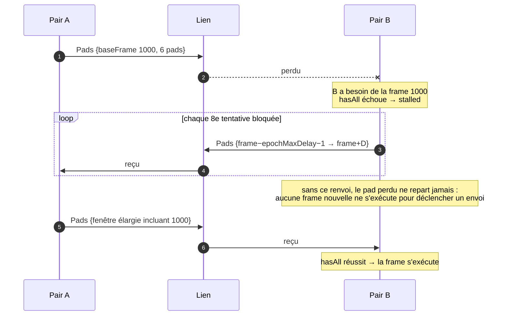

La fenêtre de renvoi s'étend jusqu'à `epochMaxDelay + 1` frames en arrière, parce
qu'un pair peut légitimement se trouver aussi loin derrière. Une fenêtre plus
courte laisse un trou que le renvoi ne comble jamais.

> **Le défaut corrigé le 28/08/2026** (commit `6d07bfb`). `epochMaxDelay` était
> documenté comme le plus grand délai qu'*un des deux* côtés ait utilisé, mais
> n'était alimenté que par le délai local. Avec 4 d'un côté et 16 de l'autre, la
> fenêtre de renvoi s'arrêtait dix frames au-dessus du trou. Le pad était toujours
> en mémoire — l'élagage garde 120 frames — mais n'était plus jamais reproposé.
> Sur un balayage de 81 combinaisons de répartitions, graines et durées de
> coupure : 36 blocages définitifs avant le correctif, 0 après.

---

## 13. Les resynchronisations

Quatre chemins mènent à un nouvel epoch. Seul l'hôte peut resynchroniser ;
l'invité passe par un message `Desync`.

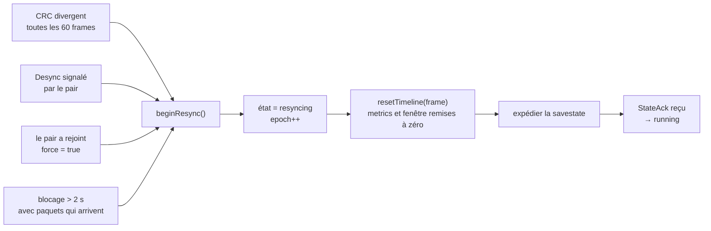

Le cas « le pair a rejoint » force le passage même depuis un état où un resync
est déjà en vol : un joueur qui revient est une meilleure information qu'une
resynchronisation dont la cible n'existe peut-être plus.

### Le filet sur blocage prolongé

Deux secondes sans qu'une frame passe, **alors que le pair envoie toujours**,
déclenchent une resynchronisation. L'horloge de blocage est maintenue à zéro tant
que les arrivées sont espacées de plus de 250 ms : pendant une coupure, un resync
expédierait l'état dans le vide, et c'est le détecteur de silence (15 s sans le
moindre paquet) qui possède ce cas.

Côté hôte uniquement. Un invité coincé cesse de produire ses propres pads en `D`
frames, donc l'hôte s'affame un quart de seconde derrière lui quelle que soit
l'origine du blocage. Faire demander l'invité passerait par un `Desync`, qui
compterait à tort comme une divergence dans les statistiques.

---

## 14. Le contrôle du délai d'entrée

`delay-control.ts` **décide, n'applique jamais** : relever le délai laisse un trou
dans la timeline qu'il faut combler et réexpédier, ce qui demande la timeline et
le transport. Le contrôleur rend donc un verdict que la session applique.

### La règle du budget

La contrainte porte sur la *somme*, pas sur chaque pair. Une frame a besoin du
pad du pair émis D frames plus tôt, et réciproquement, d'où :

```
D_hôte + D_invité ≥ RTT / durée_frame
```

Un joueur qui ne supporte pas la latence peut donc prendre 3 frames pendant que
l'autre en prend 9 : aucun n'a à couvrir seul le trajet aller.

> **La règle non devinable.** Ce qui remplit le tampon d'un pair, c'est le délai
> d'entrée de son *partenaire*, et rien qu'il contrôle lui-même. Quand quelqu'un
> signale des saccades, on relève donc le délai de **l'autre joueur**. C'est toute
> la raison d'être de l'octet `strain` sur le fil.

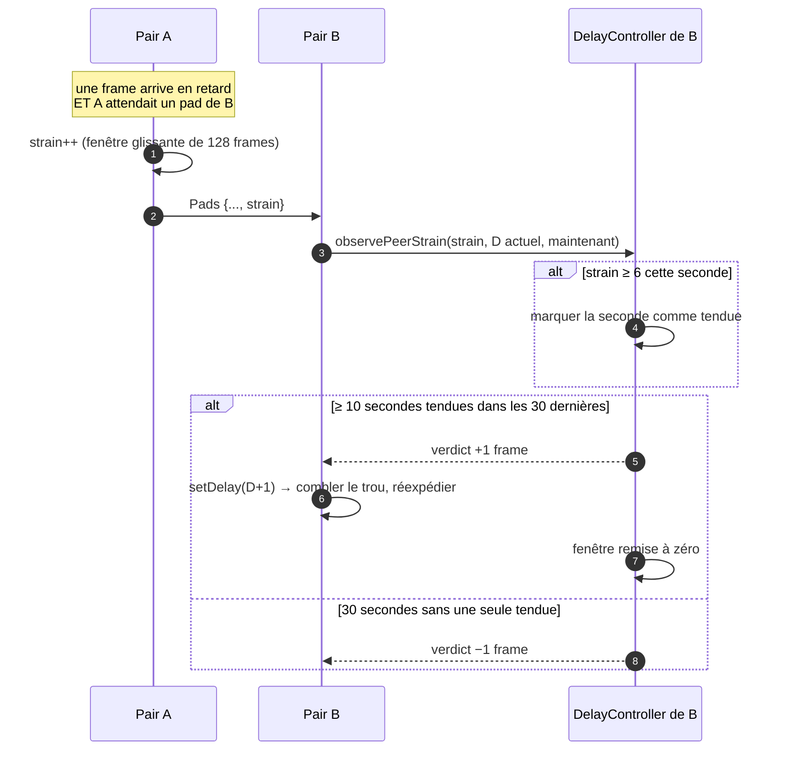

L'asymétrie est toute l'hystérésis : trente secondes propres pour rendre une
frame contre dix secondes tendues pour en prendre une. La boucle est prompte à
protéger l'autre joueur et lente à récupérer de la latence pour celui-ci.

### Constantes

| Nom | Valeur | Rôle |
|---|---|---|
| `MIN_INPUT_DELAY` | 3 | plancher de l'*estimation* initiale, qui est une supposition et doit être prudente |
| `MIN_AUTO_DELAY` | 2 | plancher où la *boucle* peut descendre, sur preuve de trente secondes propres |
| `MIN_MANUAL_DELAY` | 1 | plancher d'un délai épinglé à la main |
| `MAX_INPUT_DELAY` | 16 | plafond dur — au-delà le jeu est injouable de toute façon |
| `STRAIN_AT` | 6 | frames en retard par fenêtre à partir desquelles le pair est jugé en difficulté |
| `hungerSeconds` | 10 | secondes tendues dans la fenêtre de 30 avant d'accorder une frame |
| `padRedundancy` | 6 | frames répétées dans chaque paquet |
| `crcInterval` | 60 | frames entre deux checksums |
| `stallResendEvery` | 8 | tentatives bloquées entre deux renvois |
| `pingIntervalMs` | 2000 | intervalle de mesure du RTT en régime établi |

### Le mur

16 frames par côté couvrent 32 frames de trajet, soit **640 ms de RTT**. Au-delà,
aucun réglage ne rattrape quoi que ce soit : mesuré en production, un aller-retour
de 2670 ms demanderait 133 frames. Ce régime-là relève de la file d'attente du
lien montant, pas du netcode.

---

## 15. Les métriques du lien

`LinkMetrics` mesure et ne décide rien — séparation qui permet d'exercer les
entrées de la boucle de délai sans dérouler dix secondes de réseau simulé.

| Métrique | Définition | Piège |
|---|---|---|
| `rtt` | aller-retour ping/pong, lissé à gain 0,3 | mesuré par l'application : un client qui traite en retard le fait monter autant qu'un réseau lent |
| `jitter` | interarrivée façon RFC 3550, gain 1/16 | **aveugle aux excursions modérées** — 2,0 ms au calme contre 2,1 ms sous charge pendant que le p90 du RTT montait de 42 % |
| `strain` | frames des 128 dernières arrivées en retard *en attendant le pair* | zéro est la valeur saine, y compris pour le suiveur ; ne compte plus les retards d'origine locale depuis le 28/08/2026 |
| `arrivalGap` | **maximum** du silence entre deux livraisons, sur 64 arrivées | sain ≈ 1,2 frame ; c'est un max, pas une moyenne, délibérément |
| `arrivalClump` | **maximum** de frames apportées par une seule livraison | sain = 1 ; > 1 signifie que le relais fusionne les paquets |
| `padsAhead` | réserve contiguë par joueur | lire à 0 la plupart du temps est *normal* à deux frames de délai — lire `strain`, pas celui-ci |
| `stalls` | épisodes d'attente d'un pad | grimpe sur un lien parfaitement sain : le suiveur attend par construction |

> **Lire gap et clump ensemble.** Un long silence avec un clump de 1 signifie que
> le relais retient puis relâche ; un long silence avec un clump supérieur signifie
> qu'il fusionne. Les deux affament le tampon et appellent des corrections
> opposées, ce qui est la raison d'être des deux chiffres.

Grille calibrée sur le harness, **NTSC** (frame 16,6 ms) — en PAL, multiplier par 1,2 :

| Forme du lien | gap | clump |
|---|---|---|
| propre, livraison fine | 20 | 1 |
| nerveux (jitter 25 ms) | 56 | 2–3 |
| 5 % de perte | 36–43 | 2 |
| relais groupant ~1 frame | 32 | 1 |
| relais groupant ~3 frames | 50 | 3 |

---

## 16. Le canal direct

Le relais est en Allemagne et un pad le traverse une fois dans chaque sens : le
RTT en jeu vaut environ le double de celui du poste vers le VPS. Le DataChannel
achète cette latence — **pas de la stabilité**, la livraison du relais étant déjà
quasi parfaite au calme (gap médian de 1,25 frame, p90 à 29 ms contre 40 ms de
tampon, aucun groupement en 649 échantillons).

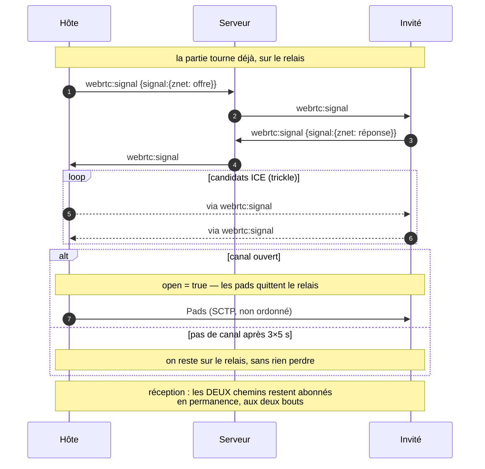

La bascule ne demande aucune coordination : chaque côté change d'avis quand il
veut, et un paquet envoyé par le canal direct peut être répondu par le relais.

Le canal est **non ordonné mais fiable**. Le désordre supprime le blocage de tête
de ligne de TCP, où un segment perdu retient tous les pads derrière lui. La
fiabilité protège la savestate, qui emprunte le même tuyau et dont un morceau
perdu coûte une réexpédition complète. Rien au-dessus ne dépend de l'ordre : pads
indexés par frame absolue, morceaux d'état par index, checksums par frame.

La signalisation réutilise `webrtc:signal`, partagé avec les modes vidéo, avec
une enveloppe `{znet: …}` pour qu'une offre destinée à une caméra ne casse pas
une négociation en cours.

**Repérer une bascule dans les logs :**

| Message | Sens |
|---|---|
| `direct channel open; the pads leave the relay` | négociation réussie |
| `no direct channel after 3 tries; staying on the relay` | NAT symétrique ou signalisation ratée — la partie continue |
| `direct channel gone; the session carries on over the relay` | repli en cours de partie, sans coupure |

Le signe le plus fiable reste la division par deux du RTT. Si le RTT ne bouge
pas, la bascule n'a pas eu lieu quoi que dise le log.

---

## 17. Cadence et rendu

`FrameGovernor` est **le seul propriétaire de timer** de la pile. Il décide
combien de `tick()` une tranche de temps réel mérite, avec un plafond par tranche
pour qu'un rattrapage après hoquet ne se transforme pas en sprint. Un onglet
caché ne recevant plus de tranches, le temps écoulé y est traité à part.

Le nommer séparément de la session est ce qui permet au mode solo de réutiliser le
même ordonnanceur sans traîner une poignée de main, un délai d'entrée et un
chemin de resynchronisation qui n'ont aucun sens à un joueur.

- **Rendu** — `webgl-renderer.ts`, avec repli canvas 2D ; surface de rendu
  partagée entre Solo et Lockstep.
- **Audio** — `AudioSink`, vidé lors d'un resync : le son encore en file
  appartient à une timeline qui n'existe plus.
- **Entrées** — `input.ts` et `devices.ts`, manettes et clavier, affectation
  partagée entre les modes.

---

## 18. Télémétrie

Le client lockstep expédie une ligne `netplay` par seconde et par joueur vers
`/api/logs`, que pino écrit sur la sortie standard du conteneur backend.

```bash
ssh <hôte> 'docker logs psnes-backend-1 2>&1 | grep "\"netplay\"" | tail -400'
```

Format ECS : `labels.player` vaut `p1` ou `p2`, `labels.roomId` groupe un match,
`trace.id` identifie un chargement de page — un même joueur qui recharge change de
trace, ce qui distingue un rechargement d'une simple reconnexion de socket.

> **Deux règles de méthode.** Les logs **ne survivent pas à un déploiement**, et
> fusionner vers `main` *est* le déploiement : la séquence est donc jouer, puis
> lire, puis déployer. Et l'outillage doit se taire pendant une mesure — récupérer
> des logs depuis le VPS charge le lien que le jeu emprunte, au point qu'une
> fenêtre déclarée « calme » a déjà lu un RTT plus haut qu'une fenêtre chargée.

---

## 19. Tests

`NetplayHarness` (`core/test/harness.ts`) fait tourner une session à deux joueurs
complète sur une **horloge virtuelle** : le vrai moteur lockstep et le vrai
protocole, seuls le réseau et l'écoulement du temps sont simulés. Un match de
soixante secondes avec 150 ms de latence et 5 % de perte s'exécute en quelques
secondes et produit exactement le même résultat à chaque fois.

| Suite | Contenu | Tests |
|---|---|---|
| `npm run test:netplay` | protocole, ordonnanceur, epoch, resync, boucle de délai, métriques, bascule de transport — contre un core factice | 101 |
| `npm run test:core` | déterminisme et lockstep contre le vrai snes9x wasm ; se saute proprement sans core ni ROM | 11 |
| `npm run test:ui` | modules d'interface et d'état applicatif | 312 |
| `npm run test:backend` | API, rooms, sauvegardes, gardes | 256 |

> **Ni les tests ni le typecheck n'invoquent le bundler**, et le déploiement est
> un `vite build`. Une branche est déjà passée avec zéro erreur `svelte-check` et
> 226 tests verts pendant que `vite build` échouait. Lancer
> `npm run build --workspace frontend` avant de déclarer une branche frontend
> terminée.

### Sentir le jeu en local

Deux fenêtres sur un même poste se joignent maintenant en direct, donc à une
latence qu'aucune vraie paire ne connaîtra. Le paramètre
`?lag=ping[,jitter[,loss]]` simule une distance et **désactive la bascule
WebRTC** pour cette raison précise : un vrai chemin pair-à-pair sous un lien
censé être connu est exactement la variable non contrôlée que le simulateur
existe pour supprimer.

---

## 20. Déploiement

Il n'y a pas d'étape manuelle. Un push sur `main` déclenche un
`repository_dispatch` vers un dépôt d'infrastructure privé, qui construit les
images, les pousse sur GHCR et se connecte au VPS. **Fusionner vers `main` *est*
le déploiement.**

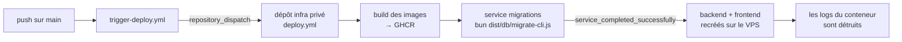

Le service `backend` dépend de la réussite des migrations : une commande de
migration qui ne correspond pas à l'image publiée **met la production à terre**,
`docker compose up` arrêtant le conteneur en cours avant que son remplaçant ne
démarre.

- Le dépôt d'infra épingle les contextes de build ; tout changement à ce que
  copient les Dockerfile doit être vérifié là-bas, où un décalage fait échouer le
  build.
- Un changement à cheval sur les deux dépôts a besoin d'une commande transitoire
  acceptant les deux images, poussée côté infra *en premier*, plutôt qu'un
  basculement sec.
- Pousser directement sur `main` fonctionne mais affiche un avertissement
  trompeur (« Changes must be made through a pull request ») juste au-dessus de
  la ligne de succès. Vérifier `git rev-parse HEAD origin/main` après un fetch
  plutôt que de lire l'avertissement comme un échec.
- Une page déjà ouverte garde son JavaScript : après un déploiement, les joueurs
  doivent **recharger**, la reconnexion du socket ne suffit pas.
